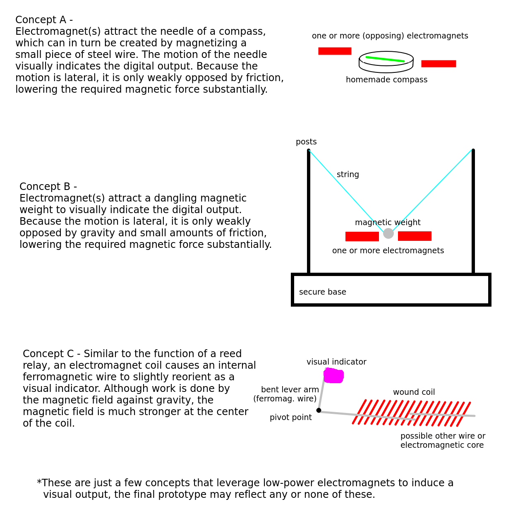

# LEVI - Low-power Electromagnetic Visual Indicator
#### Matt DiPalma, AMDG

The maximum GPIO pin source current limitation of 10-20mA on modern microcontrollers is very limiting as far as homemade, human-observable outputs are concerned. Without the ability to leverage common, cheap, mass-produced electronic devices like motors, buzzers, or LEDs, the number of candidate output devices begins to dwindle. Many promising technologies exist that leverage capacitance to drive motors, emit light via electroluminescence, or induce microscopic strains via piezoelectrics may have very low power net requirements, but are understood to have requisite voltages that exceed microcontroller logic levels by factors of 100+.

Electromagnets are one technology that can effectively leverage limited voltage and current levels because their induced magnetic fields scale with Ampere-turns, that is, the product of the current running through the wire and the number of turns. With a suitably high number of turns, a stronger field (albeit quite weak in absolute terms) can indeed be generated. And although most humans lack the ability to directly observe magnetic fields with their own senses, it is possible to use the magnetic field to attract or reorient a lightweight magnetic object which, in turn, can be visually detected by a human observer. A weak homemade electromagnet was experimentally validated in the [13001](https://github.com/marian-scientific/reports/tree/Christ/13001%20-%20GPIO%20Electromagnet) investigation at Marian Scientific.

This proposal seeks to investigate several different classes of electromagnetically-attracted visual indicators via a rapid proof-of-concept phase, and then downselect and reproduce the most successful candidate, leveraging all lessons learned during the initial phase. Some magnetic indicators under consideration for the proof-of-concept phase are depicted below:

An aggressive timeline and budget are presented below, open to negotiations. The entire schedule spans less than 4 weeks of development and fabrication time, and the labor budget includes a substantial percentage discount to account for the estimated monetary value of the experience gained through the completion of this project. I am looking forward to any involvement on this novel project, even in partnership with other individuals/groups.

#### Timeline:

  * February 19, 2025 - RFP001 posted
  * February 19, 2025 - this proposal (eagerly) submitted
  * February 21, 2025 - RFP001 deadline
  * February 22, 2025 - potential contract awarded
  * February 27, 2025 - source-by date for all prototype raw materials
  * March 2, 2025 - proof-of-concept prototypes complete
  * March 9, 2025 - final prototype complete
  * March 16, 2025 - documentation complete

#### Budget:

Material budget:
  * Magnet wire: $30
  * Steel wire: $20
  * Various frame/support structure: $25
  * Various disposables: $25

Labor budget:
  * $15/hour @ 4 hours/day @ 3 days/week @ 4 weeks = $720
  * labor discount offset for experience gained: ($520)

Total budget: $300

Regardless of the outcome of this contract award, I sincerely look forward to all future opportunities to collaborate on research projects at Marian Scientific, and I appreciate at least being considered in the evaluation.