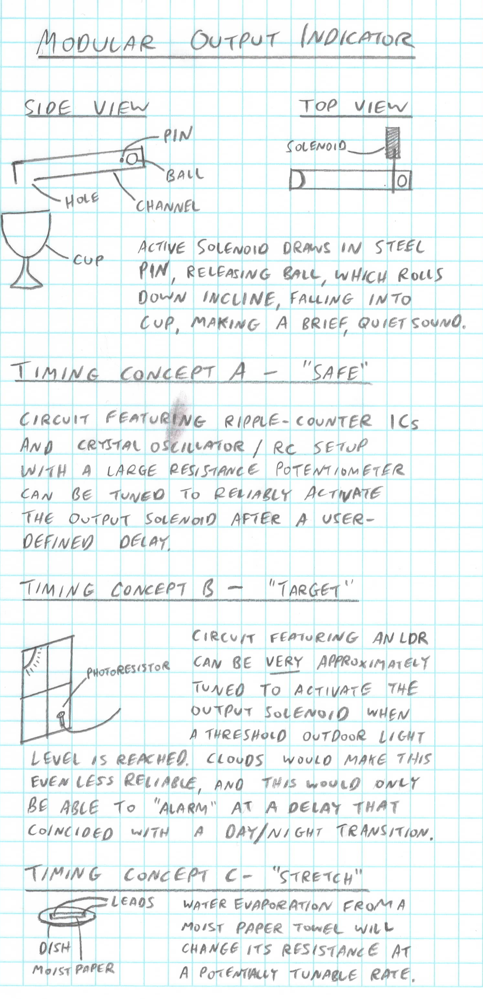

# VTBD - Variable-Time Ball Drop
*Matt DiPalma, AMDG*

One common usage of an alarm is to wake its user after a night of sleep, giving them enough time to get ready for their day. This is the theme for the proposed solutions below. For this simple purpose, it is not necessary for the alarm to sound at an atomically-precise moment, but instead, roughly indicate an appropriate wake-up time. Personally, I am an extremely light sleeper, so even a brief, quiet alarm would be effective at waking me up.

This proposal includes a modular output indicator that can be interchangeably connected to three potential time-delay estimating circuits. The concepts are ranked by their likelihood of success, from "safe" to "target" to "stretch", and leverage a wide range of phenomena to track the passage of time.

The concepts were selected to provide Marian Scientific:
* solenoid construction capability
* frame structure construction competency
* water evaporation data
* LDR data

The concepts were selected to increase my own exposure to:
* precise timing circuits & counter ICs
* LDRs
* detecting threshold voltage levels and affecting a desired output
* creating a mechanical user-interface

An aggressive timeline and budget are presented below, open to negotiations. The entire schedule spans less than 5 weeks of development and fabrication time, and the labor budget includes a substantial percentage discount to account for the estimated monetary value of the experience gained through the completion of this project. I am looking forward to any involvement on this novel project, even in partnership with other individuals/groups.

#### Timeline:

  * March 9, 2025 - RFP002 posted
  * March 15, 2025 - this proposal submitted
  * March 16, 2025 - RFP002 deadline
  * March 17, 2025 - potential contract awarded
  * March 21, 2025 - source-by date for all prototype raw materials
  * March 28, 2025 - underlying technology demonstrators due
  * April 11, 2025 - final prototypes complete
  * April 18, 2025 - documentation complete

#### Budget:

Material budget:
  * ripple counter ICs: $10
  * high-resistance potentiometers: $5
  * crystal oscillators for possible use, if RC timer accuracy insufficient: $5
  * miscellaneous electronic components: $5
  * various frame/support/UI structure & 3D-printer filament: $5
  * disposables: $10
  * unforeseen expenses allowance: $10

Labor budget:
  * $15/hour @ 4 hours/day @ 3 days/week @ 4 weeks = $720
  * labor discount offset for experience gained: ($520)

Total budget: $250

Regardless of the outcome of this contract award, I sincerely look forward to all future opportunities to collaborate on research projects at Marian Scientific, and I appreciate at least being considered in the evaluation.