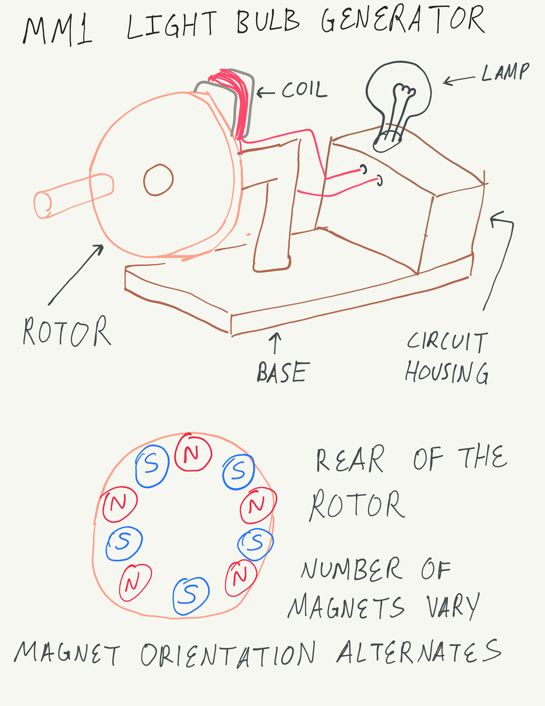
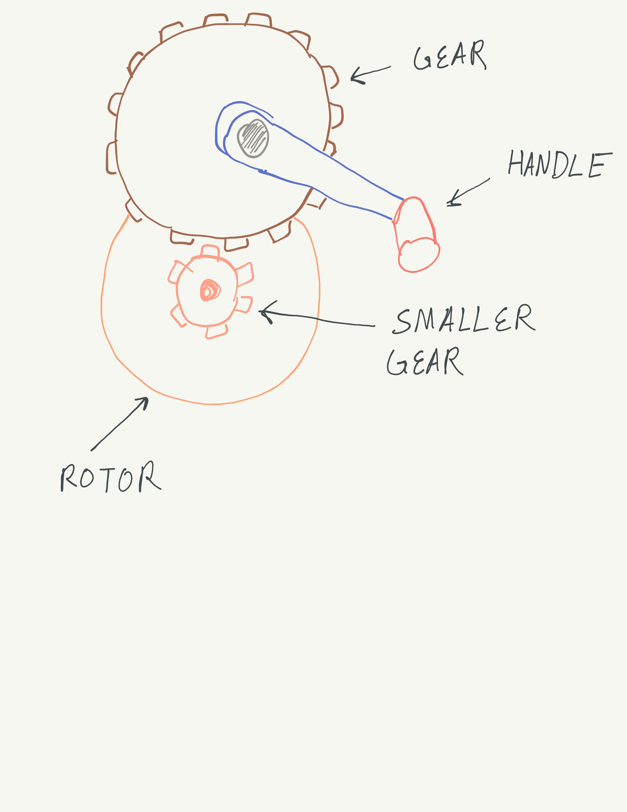

# MM1 Light Bulb Generator
*Anthony Remark, AMDG*

This product exposes the concept of converting mechanical energy to electrical energy to 6-7 year old children. This product aims to introduce the conceptualization of energy conversion.

A wooden wheel has magnets glued on, or maybe slots are cut out for the magnets to be put in place. The magnets Alternate North and South pole and they spin at the crank. A coil is fixed in place and is connected to a rectifier. This rectifier is connected to a lamp or LED or a visually appealing assortment of Lights. 

Alternatively, There is a gear that interfaces between the crank and the rotor. 

The shaft of the smaller gear is connected to the shaft of the Rotor. The Rotor shaft will then turn in place. Whereas the previous design had a Rotor rotate on a stationary shaft.

The weakness of this would be to implement the gears with wood, many pieces would need to fix together nicely. If such a feat is unachievable then the previous design may be implemented. 

#### Schedule:

  * October 31, 2025 – Proposal submitted
  * November 5, 2025 – Designs Drafted in detail due
  * November 7, 2025 – Materials gathered for construction
  * November 16, 2025 – underlying Technology demonstrators due
  * November 30, 2025 – Initial Prototype manufacture due
  * December 7, 2025 – Major prototype revisions due
  * December 14, 2025 – Minor prototype revisions due
  * December 14, 2025 – Final Delivery date

