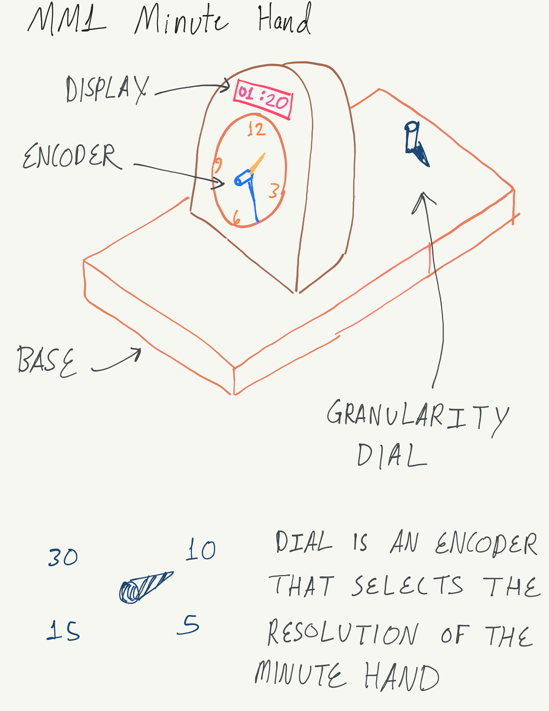
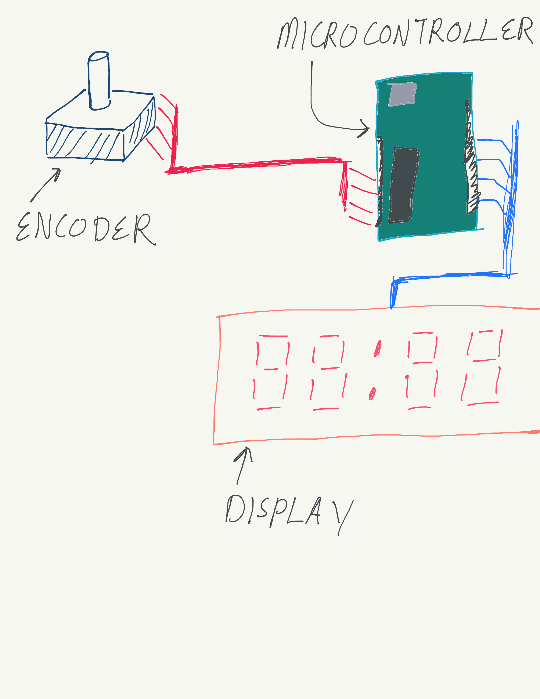

# MM1 Minute Hand
*Anthony Remark, AMDG*

This product introduces the concept of reading an analog clock to 6-7 year old children. The main idea is the minute hand and hour hand can be manipulated and configured while there is a display that can constantly read out the time. The granularity of the readout can be adjusted by a supervisor adult. Such change in granularity is desired depending on the competency or age of the child user.

The idea here is that when the minute hand is tampered with, the numbers on the display will reflect that change. Such a device is useful for instruction on the concept of adding and subtracting numbers. 

The idea of the granularity dial serves as to manipulate the perceived difficulty suitable for perhaps older children. 

The diagram represents the preliminarty idea for the circuit of the product. The encoder is connected to the minute hand and is electrically connected to the microcontroller. The programming on the controller processes the data from the encoder and then feeds the output to the display. Such electronics will be enclosed.

A clock is a great way to introduce the concept of numbers relating to eachother from a geometric point of view. This product serves as an aid to assist in the development of assessing numbers. 

The challenges would be to manufacture the gears for the hour and minute hand relationship. Also to make the whole product visually appealing for a lesson. 

#### Schedule:

  * November 1, 2025 – Proposal submitted
  * November 5, 2025 – Designs Drafted in detail due
  * November 7, 2025 – Materials gathered for construction
  * November 16, 2025 – underlying Technology demonstrators due
  * November 30, 2025 – Initial Prototype manufacture due
  * December 7, 2025 – Major prototype revisions due
  * December 14, 2025 – Minor prototype revisions due
  * December 14, 2025 – Final Delivery date