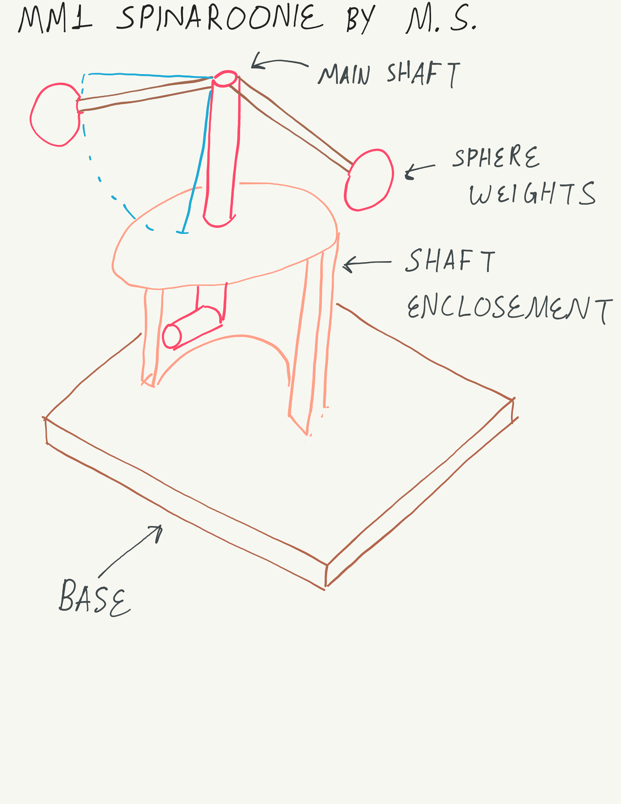

# MM1 Spinaroonie By M.S.
*Anthony Remark, AMDG*

This product serves to introduce the concept of angular momentum and conservation of angular momentum to 6-7 year old children. 

There’s a lower level where there’s a bent bar one can use to rotate (spin) the main shaft in the upper level. There are horizontal shafts connected to the top and can bend below the horizontal line. There are spheres connected at the end of these horizontal shafts that serve as weights. This toy is designed to give a feel of angular moments and the conservation of angular momentum. 

The challenge would be to construct this out of wood, but the other proposals all would require this endeavor. 

#### Schedule:

  * October 31, 2025 – Proposal submitted
  * November 5, 2025 – Designs Drafted in detail due
  * November 7, 2025 – Materials gathered for construction
  * November 16, 2025 – underlying Technology demonstrators due
  * November 30, 2025 – Initial Prototype manufacture due
  * December 7, 2025 – Major prototype revisions due
  * December 14, 2025 – Minor prototype revisions due
  * December 14, 2025 – Final Delivery date

