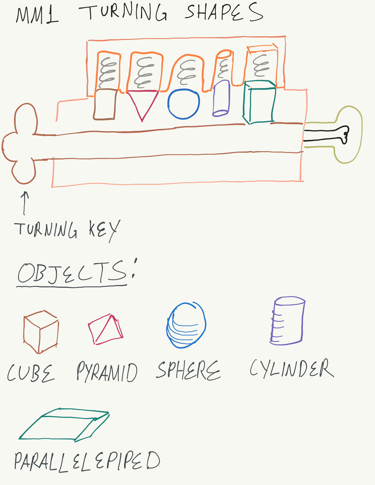
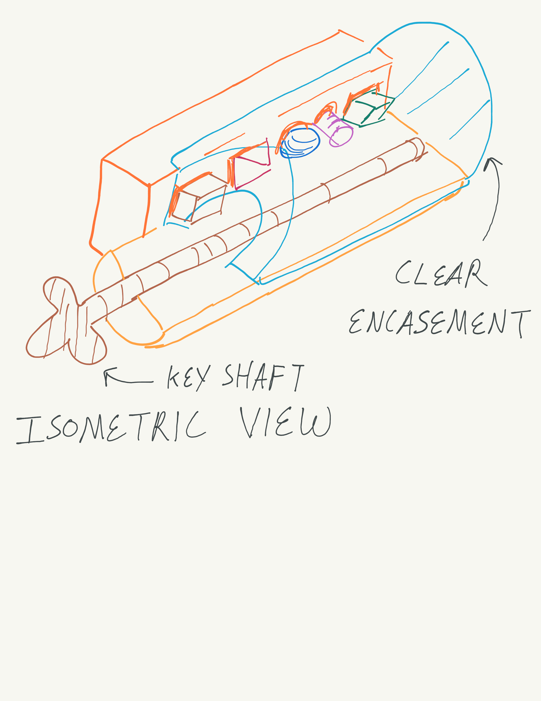

# MM1 Turning Shapes
*Anthony Remark, AMDG*

This product introduces the concept of 3D shapes and how they fit in place to turn on a light. Kids of the ages 6-7 will be introduced to the dynamics of 3D objects and how they interface with accompanying shapes. 

This is a lockpicking simulator that’s designed to demonstrate the shapes and how the shapes interface with their chamfer-like counter parts.

The described shapes each have an enclosure unique to that shape. Each fitted with a spring. This serves as a puzzle game that the user must find an object to make the shapes go inside the enclosure. The user will have to keep his/her hand on the key shaft and find a method to depress to overcome the spring force. Should the use stop turning the key shaft, the springs should push out the shapes back to their original positions. 

When the puzzle is solved, the lamp should turn on. This can be accomplished via a fully rotated shaft will turn a switch on. 

The Isometric view clearly shows the clear encasement. This doesn’t need to be curved as plexi-glass cut in a box shaped can be sufficient. 

As with the other proposals I have writted, the manufacture will require some basics with wood working and construction. In either circumstance, The Electrical team is eager to achieve great things with this endeavor. 

#### Schedule:

  * October 31, 2025 – Proposal submitted
  * November 5, 2025 – Designs Drafted in detail due
  * November 7, 2025 – Materials gathered for construction
  * November 16, 2025 – underlying Technology demonstrators due
  * November 30, 2025 – Initial Prototype manufacture due
  * December 7, 2025 – Major prototype revisions due
  * December 14, 2025 – Minor prototype revisions due
  * December 14, 2025 – Final Delivery date
