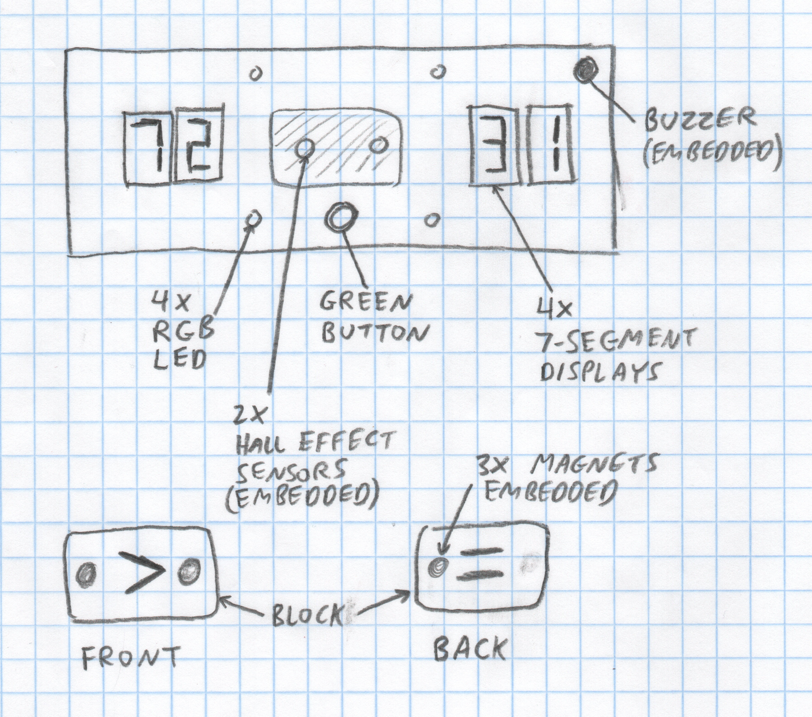
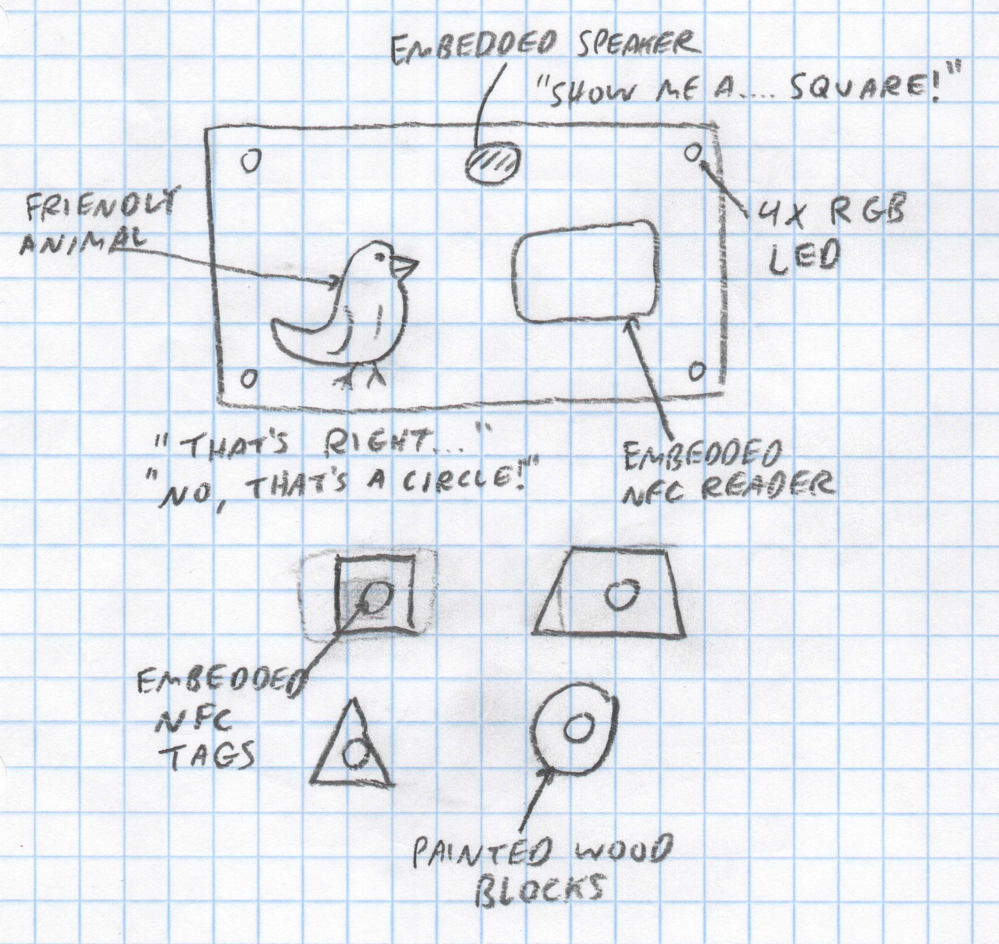

# xMM1
*Matt DiPalma, AMDG*

Below are two proposed microcontroller experiences that expose 6-7 yr old children to the concepts of numerical comparison and geometric shapes. I will pursue whichever the organization deems suitable and sufficiently unique from other proposals.

Each will leverage a suitable microcontroller and will receive power from a 5V USB-C connector.

#### xMM1a

#### xMM1b

#### Timeline:

  * October 28, 2025 - RFP004 posted
  * October 31, 2025 - this proposal submitted
  * November 16, 2025 - underlying technology demonstrators due
  * November 30, 2025 - initial prototype manufacture due
  * December 7, 2025 - major prototype revisions due
  * December 14, 2025 - minor prototype revisions due
  * December 14, 2025 - final delivery date